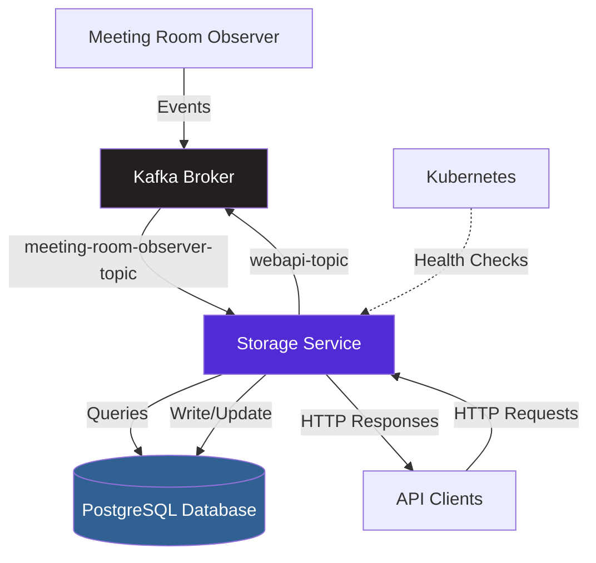
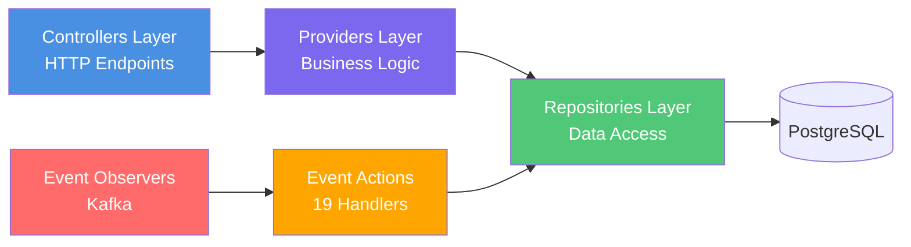
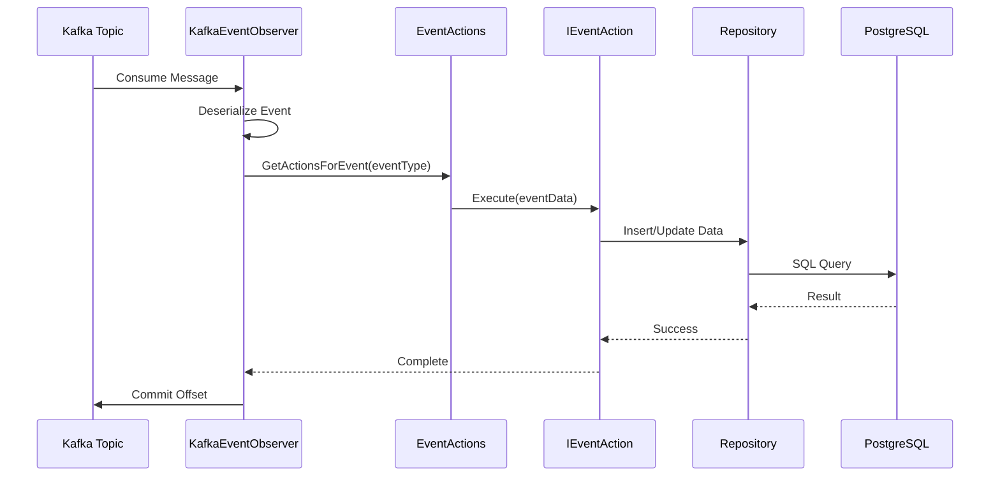

# Datapumppu Storage Service


Backend storage service for City of Helsinki's meeting management system (Datapumppu). Provides real-time event processing, persistent data storage, and RESTful API access for meeting information, decisions, votes, statements, and statistics.

## Table of Contents

- [Datapumppu Storage Service](#datapumppu-storage-service)
  - [Table of Contents](#table-of-contents)
  - [About](#about)
  - [Key Features](#key-features)
  - [Architecture](#architecture)
    - [System Context](#system-context)
    - [Internal Architecture](#internal-architecture)
    - [Event-Driven Architecture](#event-driven-architecture)
  - [Built With](#built-with)
  - [Prerequisites](#prerequisites)
  - [Getting Started](#getting-started)
    - [Installation](#installation)
    - [Configuration](#configuration)
    - [Running Locally](#running-locally)
    - [Docker Setup](#docker-setup)
  - [API Documentation](#api-documentation)
    - [API Overview](#api-overview)
    - [Key Endpoints](#key-endpoints)
    - [Event Types](#event-types)
  - [Database](#database)
  - [Deployment](#deployment)
    - [Kubernetes](#kubernetes)
    - [CI/CD Pipeline](#cicd-pipeline)
    - [Health Monitoring](#health-monitoring)
  - [Development](#development)
    - [Project Structure](#project-structure)
    - [Code Documentation](#code-documentation)
    - [Testing](#testing)

## About

The **Datapumppu Storage Service** is a .NET 6 microservice that serves as the central data persistence and API layer for City of Helsinki's meeting management system. It processes real-time events from meeting room observers via Kafka, stores meeting data in PostgreSQL, and provides RESTful APIs for accessing meeting information, decisions, voting results, statements, and statistics.

This service handles:
- **Event Processing**: Consumes events from Kafka topics and processes them through specialized action handlers
- **Data Persistence**: Stores meeting data with automatic database migrations and cleanup
- **API Layer**: Provides RESTful endpoints for querying meeting information
- **Multi-language Support**: Returns data in Finnish or Swedish based on client requests
- **Health Monitoring**: Exposes health check endpoints for Kubernetes liveness and readiness probes

## Key Features

**Real-time Event Processing** — Consumes and processes 23 different event types from Kafka topics  
**RESTful API** — Comprehensive endpoints for meetings, decisions, votes, statements, and statistics  
**PostgreSQL Persistence** — Reliable data storage with automatic migrations via Dapper ORM  
**Multi-language Support** — Finnish and Swedish language support for meeting data  
**Health Monitoring** — Built-in health checks for database connectivity and application status  
**Docker & Kubernetes** — Production-ready containerization and orchestration support  
**Event-Driven Architecture** — Decoupled design with 19 specialized action handlers  
**Automatic Database Cleanup** — Scheduled cleanup of old data via DatabaseCleaner service  

## Architecture

### System Context

The Storage Service is one microservice within the larger **Datapumppu ecosystem**. It integrates with external systems as shown below:



### Internal Architecture

The Storage Service follows a **three-layered architecture** pattern:



**Layer Responsibilities:**

- **Controllers** (`Storage/Controllers/`) — Handle HTTP requests, validate input, format responses
- **Providers** (`Storage/Providers/`) — Implement business logic, aggregate data, perform transformations
- **Repositories** (`Storage/Repositories/`) — Execute SQL queries via Dapper, manage transactions
- **Event Observers** (`Storage/Events/`) — Consume messages from Kafka topics
- **Event Actions** (`Storage/Actions/`) — Process specific event types and update database

### Event-Driven Architecture

Events flow through the system as follows:



**Supported Event Types** (23 total):
- Meeting lifecycle: `MeetingStarted`, `MeetingEnded`, `Pause`, `MeetingContinues`
- Voting: `VotingStarted`, `VotingEnded`, `propositions`
- Statements: `StatementReservation`, `StatementStarted`, `StatementEnded`
- Participants: `PersonArrived`, `PersonLeft`, `seat assignments`
- Roll calls, speech timers, video synchronization...

## Built With

| Technology | Version | Purpose |
|------------|---------|---------|
| [.NET](https://dotnet.microsoft.com/) | 6.0 | Application framework |
| [PostgreSQL](https://www.postgresql.org/) | 14+ | Relational database |
| [Kafka](https://kafka.apache.org/) | via Confluent.Kafka 2.8.0 | Event streaming |
| [Dapper](https://github.com/DapperLib/Dapper) | 2.0.123 | Micro ORM for data access |
| [AutoMapper](https://automapper.org/) | 12.0.0 | Object-to-object mapping |
| [Npgsql](https://www.npgsql.org/) | 7.0.0 | PostgreSQL .NET driver |
| [AspNetCore.HealthChecks](https://github.com/Xabaril/AspNetCore.Diagnostics.HealthChecks) | 6.0.2 | Health monitoring |

## Prerequisites

Before you begin, ensure you have the following installed:

- **[.NET 6 SDK](https://dotnet.microsoft.com/download/dotnet/6.0)** — Required to build and run the application
- **[Docker](https://www.docker.com/get-started)** — For containerized development and deployment
- **[PostgreSQL 14+](https://www.postgresql.org/download/)** — Database server (local or via Docker)
- **[Apache Kafka](https://kafka.apache.org/downloads)** — Event streaming platform (local or via Docker)
- **[Git](https://git-scm.com/)** — Version control

**Recommended IDEs:**
- Visual Studio 2022
- Visual Studio Code with C# extension

## Getting Started

### Installation

1. **Clone the repository:**
   ```bash
   git clone <repository-url>
   cd datapumppu-storage
   ```

2. **Set up PostgreSQL database:**
   ```bash
   # Using Docker
   docker run --name datapumppu-postgres \
     -e POSTGRES_USER=root \
     -e POSTGRES_PASSWORD=root \
     -e POSTGRES_DB=datapumppu \
     -p 5432:5432 \
     -d postgres:14
   ```
   
   Alternatively, create a database manually:
   ```sql
   CREATE DATABASE datapumppu;
   ```

3. **Set up Kafka:**
   ```bash
   # Using Docker Compose is recommended
   # See kafka/ folder for topic configurations
   ```

4. **Restore dependencies:**
   ```bash
   dotnet restore
   ```

### Configuration

Configure the application using environment variables or `appsettings.Development.json`:

| Variable | Description | Example |
|----------|-------------|---------|
| `STORAGE_DB_CONNECTION_STRING` | PostgreSQL connection string | `Host=localhost:5432;User Id=root;Password=root;Database=datapumppu` |
| `KAFKA_BOOTSTRAP_SERVER` | Kafka broker address | `localhost:9092` |
| `KAFKA_CONSUMER_TOPIC` | Topic to consume events from | `meeting-room-observer-topic` |
| `KAFKA_PRODUCER_TOPIC` | Topic to publish events to | `webapi-topic` |
| `KAFKA_GROUP_ID` | Consumer group identifier | `storage-consumer` |
| `PASSWORD_SALT` | Salt for API key hashing | `your-secret-salt` |

**Example `appsettings.Development.json`:**
```json
{
  "STORAGE_DB_CONNECTION_STRING": "Host=localhost:5432;User Id=root;Password=root;Database=datapumppu",
  "KAFKA_BOOTSTRAP_SERVER": "localhost:9092",
  "KAFKA_CONSUMER_TOPIC": "meeting-room-observer-topic",
  "KAFKA_PRODUCER_TOPIC": "webapi-topic",
  "KAFKA_GROUP_ID": "storage-consumer",
  "PASSWORD_SALT": "your-secret-salt"
}
```

### Running Locally

1. **Restore packages:**
   ```bash
   dotnet restore
   ```

2. **Build the solution:**
   ```bash
   dotnet build Storage.sln
   ```

3. **Run the application:**
   ```bash
   dotnet run --project Storage/Storage.csproj
   ```

The application will start on `http://localhost:8080` by default.

**Verify the application is running:**
```bash
curl http://localhost:8080/healthz
# Expected: Healthy

curl http://localhost:8080/readiness
# Expected: Healthy (if database is connected)
```

> **Auto-Migration:** Database tables and schema are automatically created/migrated on startup via `DatabaseMigrationService`.

### Docker Setup

**Build Docker image:**
```bash
docker build -t datapumppu-storage:latest .
```

**Run container:**
```bash
docker run -d \
  --name datapumppu-storage \
  -p 8080:8080 \
  -e STORAGE_DB_CONNECTION_STRING="Host=host.docker.internal:5432;User Id=root;Password=root;Database=datapumppu" \
  -e KAFKA_BOOTSTRAP_SERVER="host.docker.internal:9092" \
  -e KAFKA_CONSUMER_TOPIC="meeting-room-observer-topic" \
  -e KAFKA_PRODUCER_TOPIC="webapi-topic" \
  -e KAFKA_GROUP_ID="storage-consumer" \
  -e PASSWORD_SALT="your-secret-salt" \
  datapumppu-storage:latest
```

> **Tip:** For local development, use `host.docker.internal` to access services running on your host machine from within Docker containers.

## API Documentation

### API Overview

The Storage Service provides RESTful APIs organized by the following controllers:

| Controller | Purpose | Example Endpoints |
|------------|---------|-------------------|
| **AuthenticationController** | API key validation | `GET /api/authentication/validate` |
| **DecisionsController** | Decision data retrieval | `GET /api/decisions/{caseIdLabel}/{language}` |
| **ReservationsController** | Statement/reply reservations | `GET /api/reservations/{meetingId}/{caseNumber}` |
| **SeatsController** | Meeting seat allocation | `GET /api/seats/{meetingId}` |
| **StatementController** | Statement information | `GET /api/statement/{meetingId}/{personId}` |
| **VideoSyncController** | Video position synchronization | `POST /api/videosync/position` |
| **VotesController** | Voting results | `GET /api/votes/{meetingId}/{caseNumber}` |
| **MeetingInfoController** | Comprehensive meeting data | `GET /api/meetinginfo/{meetingId}` |
| **Statistics Controllers** | Meeting statistics | Various endpoints for stats |

### Key Endpoints

| Method | Endpoint | Description | Example |
|--------|----------|-------------|---------|
| GET | `/healthz` | Liveness probe | Health check for Kubernetes |
| GET | `/readiness` | Readiness probe with DB check | Verifies database connectivity |
| GET | `/api/decisions/{caseIdLabel}/{language}` | Get decision by case label | `/api/decisions/abcd1234/fi` |
| GET | `/api/votes/{meetingId}/{caseNumber}` | Get voting results | `/api/votes/12345/1` |
| GET | `/api/reservations/{meetingId}/{caseNumber}` | Get statement reservations | `/api/reservations/12345/1` |
| GET | `/api/seats/{meetingId}` | Get seat allocation | `/api/seats/12345` |
| GET | `/api/meetinginfo/{meetingId}` | Get comprehensive meeting info | `/api/meetinginfo/12345` |
| POST | `/api/videosync/position` | Update video sync position | Body: `{ "meetingId": "12345", ... }` |
| GET | `/api/statement/{meetingId}/{personId}` | Get statements by person | `/api/statement/12345/67890` |

**Example Request:**
```bash
# Get decision data in Finnish
curl http://localhost:8080/api/decisions/abcd1234/fi

# Get voting results for a case
curl http://localhost:8080/api/votes/12345/1

# Check application health
curl http://localhost:8080/healthz
```

### Event Types

The system processes **23 different event types** from Kafka topics:

| Event Type | ID | Triggered When | Handled By |
|------------|----|--------------------|------------|
| `MeetingStarted` | 0 | Meeting begins | `UpdateMeetingStatusAction` |
| `MeetingEnded` | 1 | Meeting concludes | `UpdateMeetingStatusAction` |
| `VotingStarted` | 2 | Voting session starts | `UpdateVotingStatusAction` |
| `VotingEnded` | 3 | Voting session ends | `UpdateVotingStatusAction` |
| `Statements` | 4 | Statement batch update | `UpdateStatementsAction` |
| `Attendees` | 5 | Seat assignments updated | `UpdateMeetingSeatsAction` |
| `Case` | 6 | Case/agenda item updated | `UpsertCaseAction` |
| `RollCallStarted` | 7 | Roll call begins | `UpsertRollCallAction` |
| `RollCallEnded` | 8 | Roll call ends | `UpsertRollCallAction` |
| `StatementReservation` | 9 | Statement requested | `InsertStatementReservationAction` |
| `StatementStarted` | 11 | Statement begins | `InsertStartedStatementAction` |
| `PersonArrived` | 13 | Participant arrives | `InsertPersonEventAction` |
| `PersonLeft` | 14 | Participant leaves | `InsertPersonEventAction` |
| `PauseInfo` | 16 | Pause information | `InsertPauseInfoAction` |
| `SpeechTimer` | 19 | Speech timer event | `InsertSpeechTimerEventAction` |
| `Propositions` | 20 | Voting propositions | `InsertPropositionsEventAction` |
| `ReplyReservation` | 21 | Reply reservation | `InsertReplyReservationAction` |
| ... | | Additional event types | `InsertEventAction` (generic) |

See [Storage/EventType.cs](Storage/EventType.cs) for the complete enumeration with detailed descriptions.

## Database

**Database:** PostgreSQL 14+ (`datapumppu` database)

**Schema Management:**
- **Automatic Migrations:** The `DatabaseMigrationService` runs on application startup and automatically creates/updates database schema from SQL scripts in `Storage/SqlScripts/`
- **SQL Scripts:** Located in [Storage/SqlScripts/](Storage/SqlScripts/) directory
- **Data Access:** All database operations use [Dapper](https://github.com/DapperLib/Dapper) for high-performance SQL execution

**Main Tables:**
- `meetings` — Meeting metadata and status
- `agenda_items` — Agenda points for meetings
- `cases` — Case information
- `decisions` — Decision records
- `statements` — Statement records
- `votings` — Voting sessions and results
- `events` — Generic event log
- `participants` — Meeting participants
- `meeting_seats` — Seat allocation
- `pause_info` — Meeting pause information
- `speech_timer_events` — Speech timing data
- `propositions` — Voting propositions
- `video_sync_items` — Video synchronization data

**Data Retention:**
The `DatabaseCleaner` background service runs periodically to clean up old data based on configured retention policies.

## Deployment

### Dev/test environment

Open a PR and target the **develop** branch. Once the branch gets merged, Azure pipelines will take care of deployment.

### Staging/Production environment

Open a PR from **develop** and target the **master** branch. Once the branch gets merged, Azure pipelines will take care of deployment.

### CI/CD Pipeline

The project uses **Azure Pipelines** for continuous integration and deployment:

- **Development Branch:** [azure-pipelines-build-develop.yml](azure-pipelines-build-develop.yml)
- **Production Branch:** [azure-pipelines-build-master.yml](azure-pipelines-build-master.yml)

Pipelines automatically build, test, and deploy the service when changes are pushed to the respective branches.

### Health Monitoring

The application exposes health check endpoints for Kubernetes probes:

| Endpoint | Type | Checks | Use Case |
|----------|------|--------|----------|
| `/healthz` | Liveness | Application is running | Restarts unhealthy pods |
| `/readiness` | Readiness | Database connectivity (NpgSql) | Routes traffic only when ready |

**Kubernetes Health Check Configuration:**
```yaml
livenessProbe:
  httpGet:
    path: /healthz
    port: 8080
  initialDelaySeconds: 10
  periodSeconds: 10

readinessProbe:
  httpGet:
    path: /readiness
    port: 8080
  initialDelaySeconds: 5
  periodSeconds: 5
```

## Development

### Project Structure

```
datapumppu-storage/
├── Storage/
│   ├── Controllers/          # HTTP API endpoints
│   │   ├── MeetingInfo/     # Meeting information endpoints
│   │   └── Statistics/      # Statistics endpoints
│   ├── Providers/           # Business logic layer
│   │   ├── DTOs/           # Data transfer objects
│   │   └── Statistics/     # Statistics providers
│   ├── Repositories/        # Data access layer
│   │   ├── Statistics/     # Statistics repositories
│   │   └── Migration/      # Database migration
│   ├── Actions/            # Event action handlers (19 handlers)
│   ├── Events/             # Event observers and DTOs
│   │   ├── Providers/      # Event-related providers
│   │   └── DTOs/          # Event data transfer objects
│   ├── Mappers/            # AutoMapper configurations
│   ├── SqlScripts/         # SQL migration scripts
│   ├── Program.cs          # Application entry point
│   ├── EventType.cs        # Event enumeration (23 types)
│   └── *.cs               # Domain models (SpeechType, VoteType, etc.)
├── StorageServiceUnitTests/ # Unit tests
├── k8s/                    # Kubernetes manifests
├── kafka/                  # Kafka resource definitions
├── Dockerfile              # Container build specification
└── Storage.sln             # Solution file
```

### Code Documentation

All public types and methods include **XML documentation comments** following C# standards:

```csharp
/// <summary>
/// Retrieves decision data by case label and language.
/// </summary>
/// <param name="caseIdLabel">The case identifier label.</param>
/// <param name="language">Language code (fi/sv).</param>
/// <returns>Decision data if found, otherwise NotFound.</returns>
[HttpGet("{caseIdLabel}/{language}")]
public async Task<IActionResult> GetDecisions(string caseIdLabel, string language)
```

Documentation is automatically generated when building with `<GenerateDocumentationFile>true</GenerateDocumentationFile>` (enabled in [Storage.csproj](Storage/Storage.csproj)).

### Testing

**Unit Tests:** Located in [StorageServiceUnitTests/](StorageServiceUnitTests/)

**Run Tests:**
```bash
# Run all tests
dotnet test

# Run tests with coverage
dotnet test /p:CollectCoverage=true

# Run specific test file
dotnet test --filter "FullyQualifiedName~YourTestClassName"
```

---

**Last Updated:** 20.03.2026